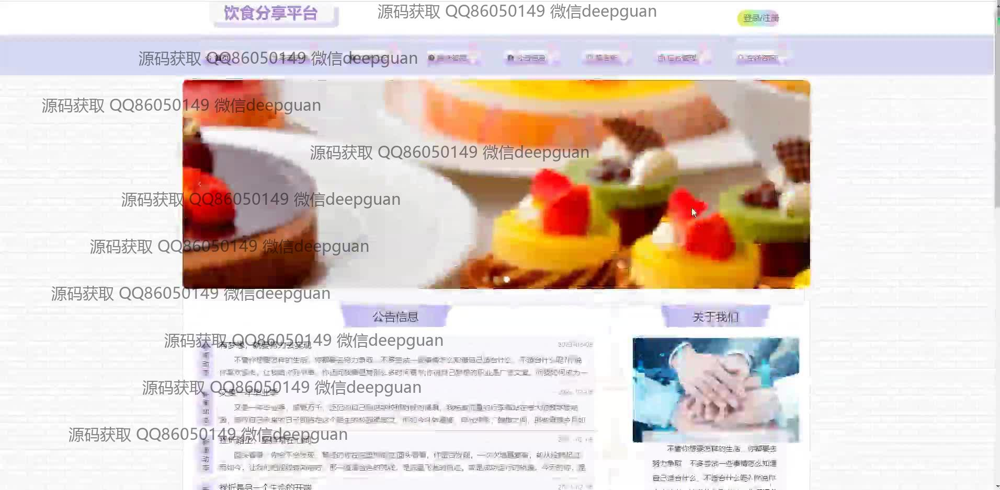
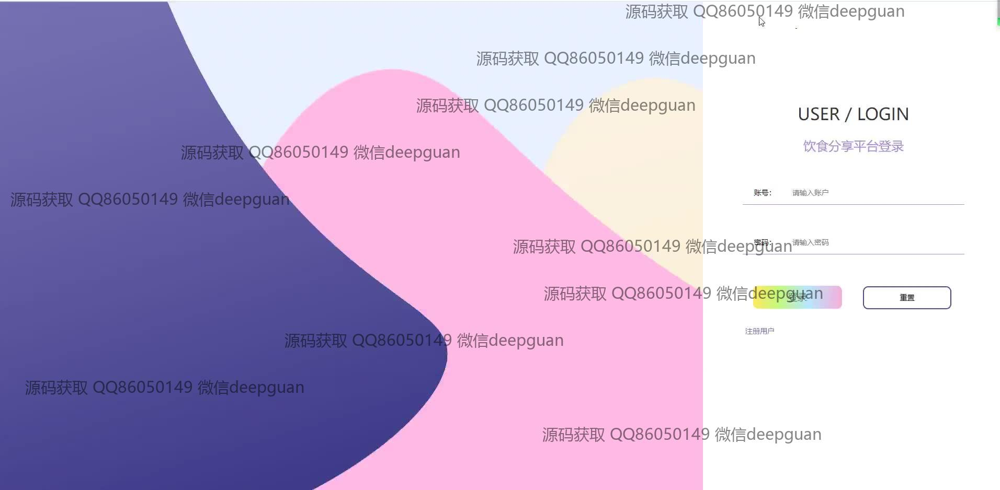
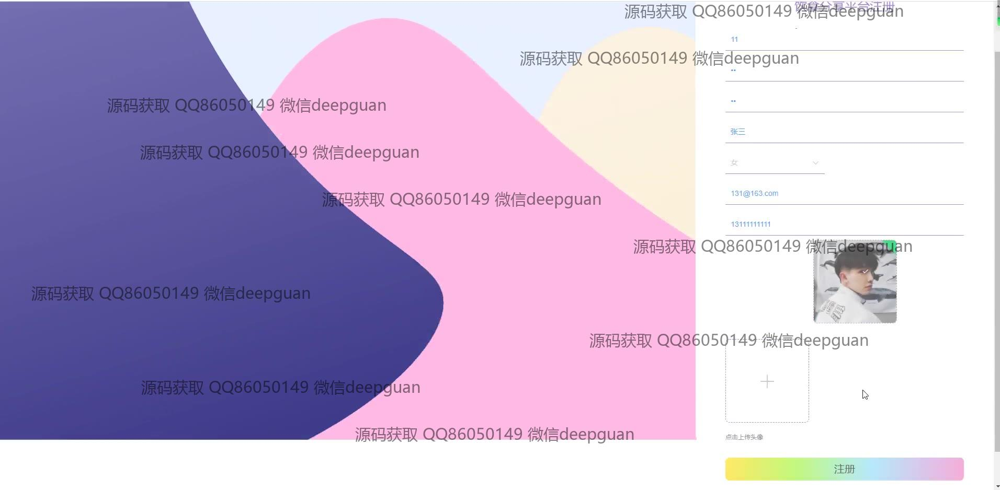
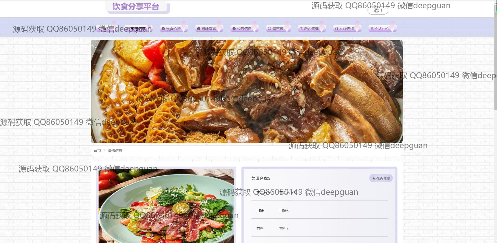

<h1 align="center">饮食分享平台</h1>

## 简介
饮食分享平台：用户和管理员可浏览和分享食谱，管理和发布菜谱信息，同时互动留言、评论和点赞；支持考试和趣味题目功能，提供健康饮食建议和菜品推荐。    --计算机毕业设计源码；毕设源码；java毕业设计源码

## 联系方式

<h3 align="center">获取完整代码与数据库文件 + 微信：deepguan QQ: 86050149 QQ群: 783742310</h3>

<h3 align="center">可帮忙远程部署 包运行成功！提供远程部署、修改代码、设计文档指导、代码讲解等服务！</h3>

## 功能介绍（完整见运行截图）
管理员：基本功能包括登录、注册和退出。管理用户、菜品分类、试题信息及发布公告。支持查看用户账号、操作日志等信息。具备考试记录管理和查询功能，以及菜谱、趣味套餐、公告和试题的编辑与管理选项。界面设计简洁，操作方便。  
用户：基本功能包括登录、注册、退出。可浏览主页、食谱分类和美食推荐，查看和分享菜谱，跟随平台公告。具备添加、修改和删除自己的菜谱功能。参与食物相关知识测试，查看考试成绩和详细信息。可与其他用户互动，进行评论、点赞，增强参与感。

## 运行截图

本代码来源于网络,仅供学习参考使用!

